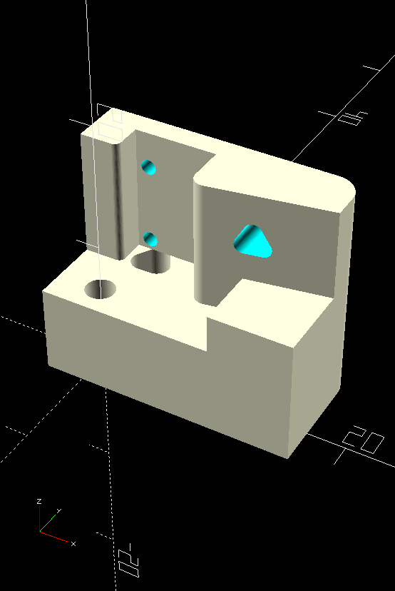

# RueMoicroswitch
Because I needed a custom lever

This didn't work out for me, maybe you can find a use for it.

This is not as sensitive as a real microswitch, but it does offer a design thats quite easy to make custom levers for. 

The buttons come in a wide variety of heights, the bump this one is designed for is 1.5mm high.

The retaining screw for the lever is an M3 washerhead screw

The lever wire is 1/16" diameter.

There are two mounting holes in the bottom 10mm apart as per a normal microswitch

printed in PLA, no supports needed.

Have fun!

